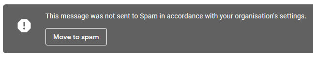
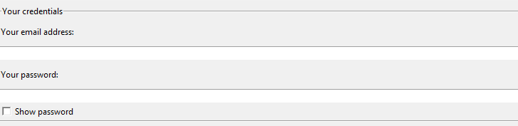
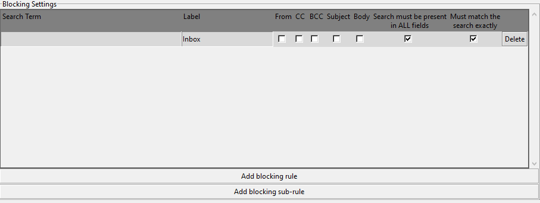
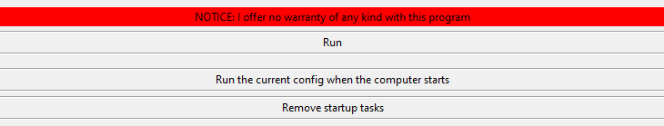

# EmailBlocker
Deletes emails from blacklisted addresses (Gmail only)

Are you a student? Do you have a school/college email? Are you tired of recieving borderline spam emails from your place of education?
Does your school's GSuite policies make it impossible for you to actually block people?

Well I (possibly) have a solution for you! This program will run through your inbox and delete all emails from certain email addresses.

## Setup
First you have to enable 'less secure app access' in your google account settings.
If your school has had the common sense to lock this setting down then I'm sorry but it's too late for you.

* Go to your school email inbox, click on your profile picture in the top right corner and click on 'Manage Accout Settings'
* Search 'less secure app access' in the search bar and hit enter
* Enable the setting
* Download this program

## Running the program
* Open the folder you downloaded the program to
* Double click on `EmailBlocker.bat` to run the program

If you want to read the source code for this program it is contained within the '.py' files.

### Things to note
* This program may get flagged as a virus. This is because the app isnt "signed" (verified) in any way.
* If you use the options "Save settings" or "Run at startup" then your credentials will be stored in a plain text file.

## Usage
#### Step 1: Entering Credentials

This is fairly straight forward. You will see some input boxes similar to this at the top of the program

Simply enter your email address and password to get started.  
NOTE: You must have enabled 'less secure app access' with the GMail account you wish to use (see the setup section above)

#### Step 2: Creating your filtering rules

Here is where you will create the set of rules that the program will use to select which emails to delete. There are a few options here which I will go through.

**Search Term**:  
The search term is what you are searching to filter out. This could be anything like an email address, a key word/phrase.
This is the string that the program will search for in the various fields you tell it to (specified next). If a field contains your search term then that email will be deleted

**From**:  
When this box is checked then any emails with a sender that matches your search term will be deleted.

**CC and BCC**:  
If either of these boxes are checked then any emails with your search term in the CC or BCC fields are deleted.
See the NOTE at the end for a couple details

**Subject**:  
If checked, any emails with your search term as the subject will be deleted

**Body**:  
If checked, any emails with a body that matches your search term will be deleted

**Search must be present in ALL fields**:  
This means that if you have selected the subject and body checkboxes then emails will only be deleted if the search term matches BOTH the subject AND the body.
If this option is not checked then emails that match EITHER criteria are deleted

**Must match the search exactly**:  
If checked then for an email to be filtered it must have whatever field of information match your search term EXACTLY.  
For example, if you were searching by subject for "Leaf Blowers" then emails with that exact subject would be deleted but subjects like "Cool Leaf Blowers", "leaf blowers" and "concert tickets" would not be deleted.

If this option is disabled then if the email's field of information CONTAINS your search query, it will be deleted.
This is the equivalent of typing the query into the gmail search bar and deleting all the results.

**Delete**:  
Does not delete the emails. It deletes that specific rule.

**Add blocking rule**:  
Spawns a new row (or focuses on an empty one) for you to add a rule to. You can add as many as you want but the window doesn't have a scrollbar so don't add too many

**Note**:  
For any categories that usually require email addresses (From, CC and BCC), a query like `joe@example.com` will return all emails concerning that address. A query like `joe` will return all emails concerning email addresses that start with `joe`. However, a search like `joe@example` will return nothing because that is an invalid email address.

#### Step 3: Saving settings

**Save these settings**:  
Saves your current email, password and filtering rules to a file called `settings.json` in the same directory as the code. This file will store all these details in PLAIN TEXT, meaning anyone can open it and read your password.
This file is also formatted in such a way to make it very nicely human readable

**Load saved settings**:  
Clears your current configuration and fills all options with whatever is saved in the `settings.json` file

**Load your saved settings on launch**:  
If checked then when the program next starts up it will attempt to load whatever is saved in the `settings.json` file and autofill in the prompts

#### Step 4: Deleting the emails

**The notice**:  
Just in case the program goes rogue and deletes all your emails.
If that does happen (unlikely) then emails usually aren't deleted right away. They usually get moved to the "trash" folder. If you need those emails back, go there and move them back to the inbox

**Run**:  
This will take the configuration you have currently, not the save file but your currrent on-screen settings, and run through your inbox deleting the relevant emails.
I suggest that if you run this you should go to your gmail's "trash" folder and double-check that the correct emails were in fact blocked to ensure that the settings you have configured will have the desired effect.

**Run the current config when the computer starts** [Windows Only]:  
Create a script that will run this program whenever you sign into your account.  

It will create a the folder `~\AppData\Roaming\Microsoft\Windows\Start Menu\Programs\EmailBlockerLite` and copy the embedded pyton interpreter, `EmailBlockerLite.py` and `filter_emails.py` to that directory. Then, similar to the run button, this will take the configuration you have currently (not the save file but your currrent on-screen settings) but it will save them to another `settings.json` file in the newly created directory.  
Finally, it creates the file `~\AppData\Roaming\Microsoft\Windows\Start Menu\Programs\Startup\EmailBlocker.bat`, which will run the program.

**Remove startup tasks** [Windows Only]:  
Removes any startup tasks created by the program.
Essentially reverses all the steps shown directly above.