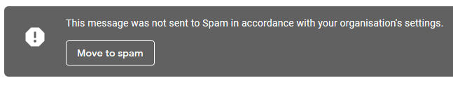

# EmailBlocker
Deletes emails from blacklisted addresses (Gmail only)

Are you a student? Do you have a school/college email? Are you tired of recieving borderline spam emails from your place of education?
Does your school's GSuite policies make it impossible for you to actually block people?

Well I (possibly) have a solution for you! This program will run through your inbox and delete all emails from certain email addresses.

## Setup
First you have to enable 'less secure app access' in your google account settings.
If your school has had the common sense to lock this setting down then I'm sorry but it's too late for you.

* Go to your school email inbox, click on your profile picture in the top right corner and click on 'Manage Accout Settings'
* Search 'less secure app access' in the search bar and hit enter
* Enable the setting
* Download this program

## Running the program
* Open the folder you downloaded the program to
* Double click the `setup.bat` file. This will move all the files into the right places so that the program can run
* Double click on `EmailBlocker.bat` to run the program

If you want to read the source code for this program it is contained within the '.py' files.

Note: This program may get flagged as a virus. This is because the app isnt "signed" (verified) in any way.

Once you boot up the program it will ask for your email address, password and the email addresses you wish to block. Fill in the relevant info and click "Run".